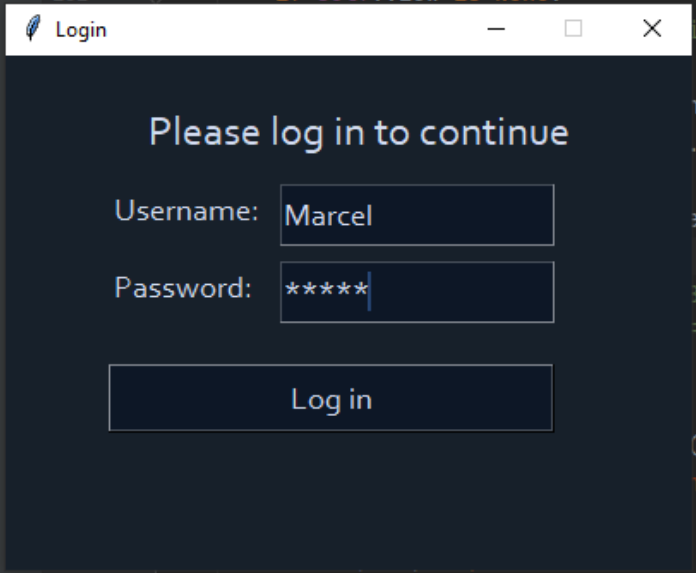
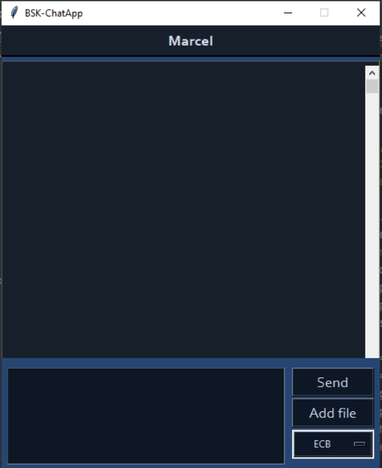
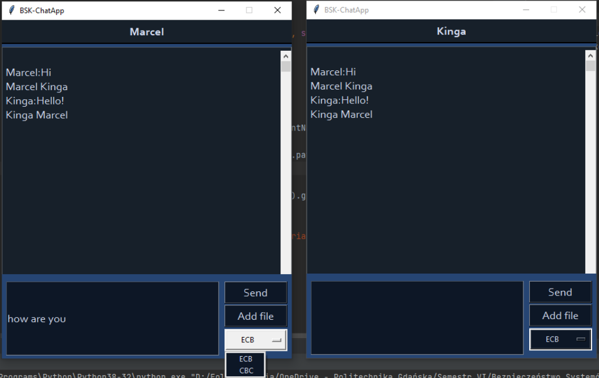
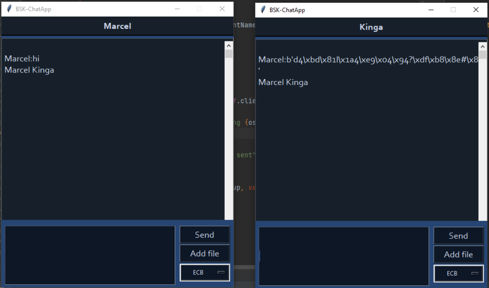
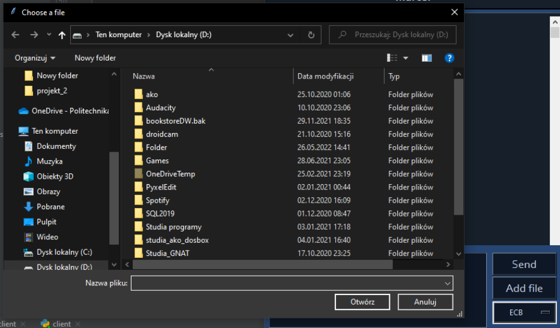
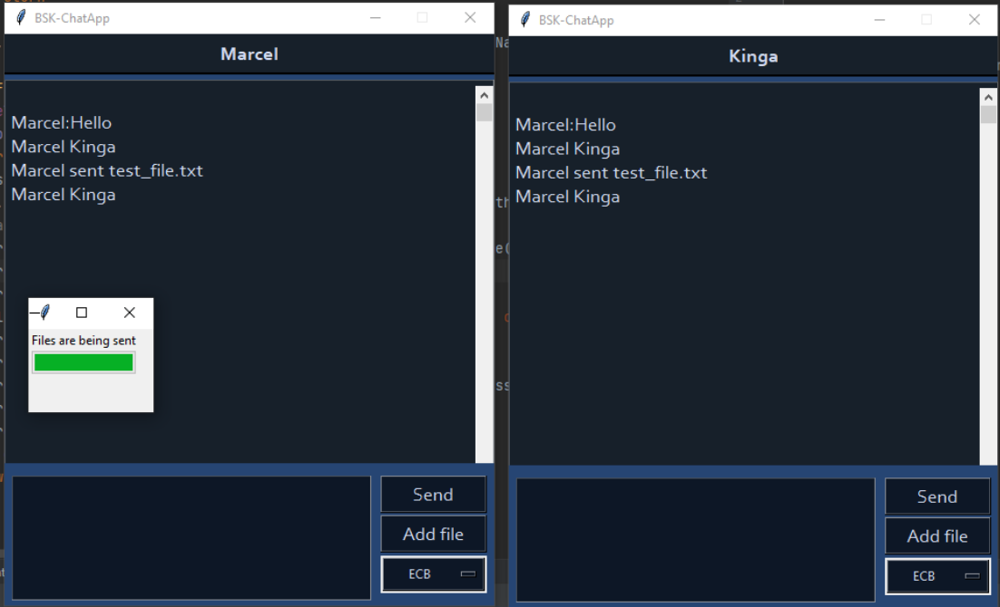
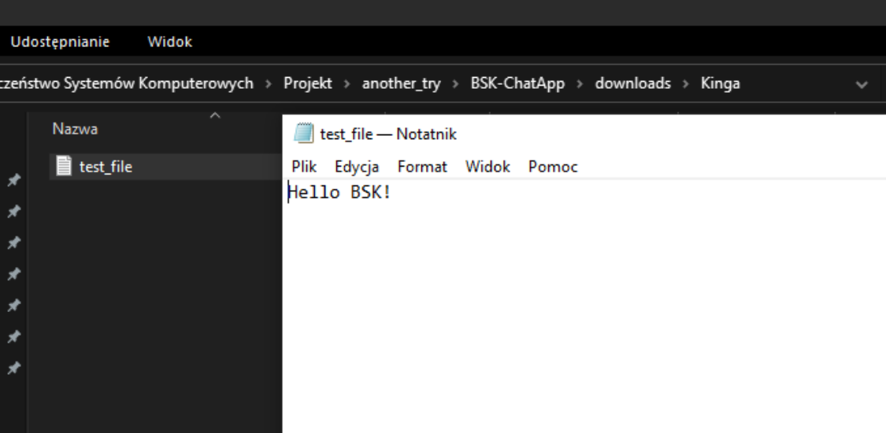
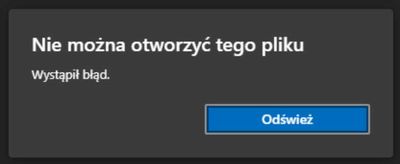

# Application and GUI interface

* [Application](#Application)
* [GUI interface](#GUI-interface)
* [Communication protocol](#Communication-protocol)
* [Secure key distribution](#Secure-key-distribution)
* [Algorithm](#Algorithm)
* [Results](#Results)
* [Summary](#Summary)
* [Authors](#Authors)

## Application
The application is written in Python. Packages used include tkinter, socket, threading, tqdm, pycryptodome, secrets and hashlib. The application has a client-server architecture.

## GUI interface
Client GUI interface was implemented with the tkinter package. The application has two different windows visible to the user. First is the login page, where the user can type in their username and password. Once they log in they are taken to the main page with the chat window, where they can type in their messages and send them. They can also select a file and send it. There is also a dropdown menu that allows the sender to select the encryption mode (CBC or EBC) to be used for data transfer. When sending files a window showcasing the progess of the transfer is displayed. Below each message appear the names of the users who have received the message - as an acknowledgement from the recipients.

Server does not have a GUI, as only client applications need to be interacted with.

## Communication protocol
The application uses TCP protocol to exchange the data between the clients and the server.

## Secure key distribution
Each client’s RSA keys are stored separately in different directories. They are encrypted with a hash of their password. Clients begin the key distribution by decrypting their keys and exchanging the public RSA keys. Then once either of them wants to send a message or a file, the sender generates a pseudorandom byte string, of length of 32 bytes, which is used as a session key for the data transfer (a new session key is used for each transfer). Then the sender encrypts the session key using the recipient’s public key they received earlier, and sends it to the recipient, along with required parameters, eg. cipher mode. Then uses the generated session key to cipher the data using the AES algorithm, and sends it to the recipient.
The recipient of the data uses their private RSA key to decode the session key and the required parameters. Then uses that session key and received parameters to decrypt the received data.

## Algorithm
The server begins with creating a socket  and binding it to the localhost address on port 9090. Then it starts listening for and accepting new connections. Once a new client connection is established, the server creates a new thread to handle incoming messages from that client. Then it broadcasts them to connected clients.

The client application starts by creating a socket, then it connects that socket to the server’s IP and port.
Next it starts the client’s GUI interface, as well as a new thread used for handling incoming messages from the server. First the client is asked to log in to the application. If it is a new client (a new username), dedicated directories for their RSA keys are created, the corresponding keys are generated, encrypted with a hash of the provided password (in CBC mode), and saved. If it is a returning user (a username used previously), then their keys are attempted to be decrypted. If The provided password is incorrect then the keys are not decrypted and pseudorandom data is obtained.
Upon login and startup of the main application, the client sends their public key to the other client, followed by a request for the other client’s public key. Then the data transfer happens according to the secure key distribution, described above. If the decryption of the RSA keys was successful, then messages display correctly and files are transferred correctly, along with the file extension. If the password provided for key decryption was incorrect then pseudorandom data is obtained, and therefore the incoming messages are illegible and the received files are unusable.

Each transfer first sends a frame of fixed size, containing the information about the size of the next frame. When sending large files, they are divided into smaller packets (up to size of 1024 bytes each), then encrypted and sent separately. When receiving such files they are decrypted and assembled back into the whole file.

Messages, as well files can be sent in both directions, as a result of the client-server architecture.

## Results
Login page:

 

Main application window:

 

Operation when clients used correct passwords:

 

(showcases also the acknowledgement message and the ability to choose different modes of cipher operation)

Operation when a client used an incorrect password (pseudorandom data):

 

File selection:

 

File transfer with correct credentials:

 
 

File transfer with incorrect credentials:

 

## Summary
All the required tasks have been implemented. The application uses the TCP protocol. It has a GUI interface with file selection. It allows for bidirectional transfer of messages and files (of any size, with file extension). Data is encrypted using the AES algorithm with the generated session key. The session key is encrypted with the public RSA key of the recipient, which are exchanged at the beginning of the communication. The session key is generated for each transfer session. The cipher parameters (CBC or ECB) can be adjusted in the GUI and are transferred to the recipient for correct decryption. In case of incorrect credentials, pseudorandom data is obtained. RSA keys are kept encrypted with a hash of the user’s password. Acknowledgement message is sent by the recipient.

## Authors

[Kinga Wladzinska](https://github.com/Popularkiya) |
[Marcel Bieniek](https://github.com/marcelbieniek) |

2022